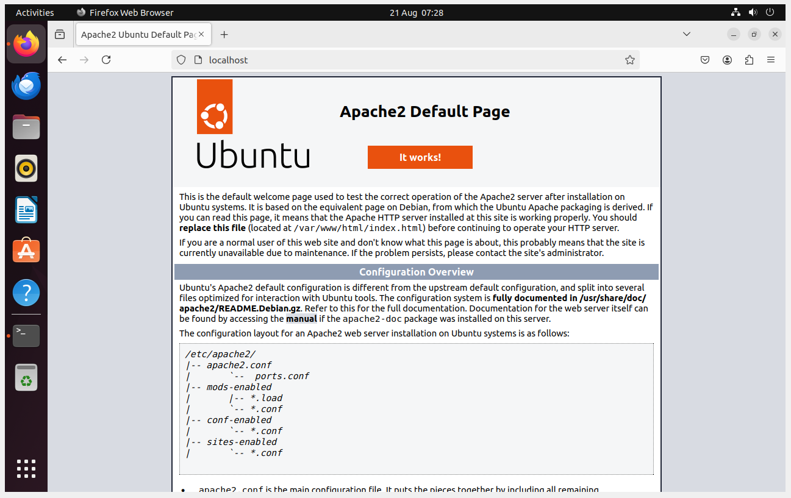
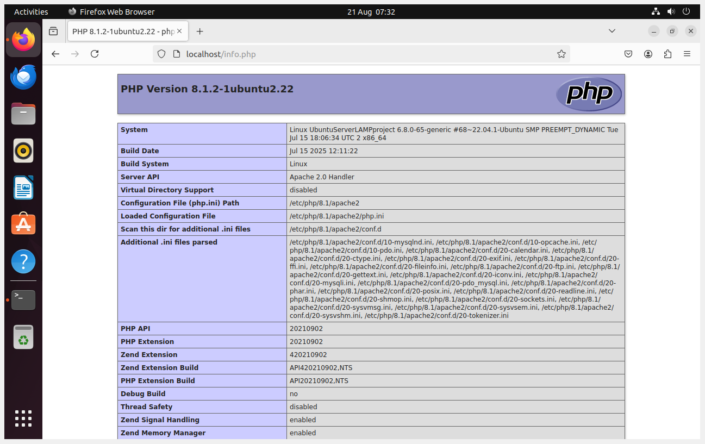
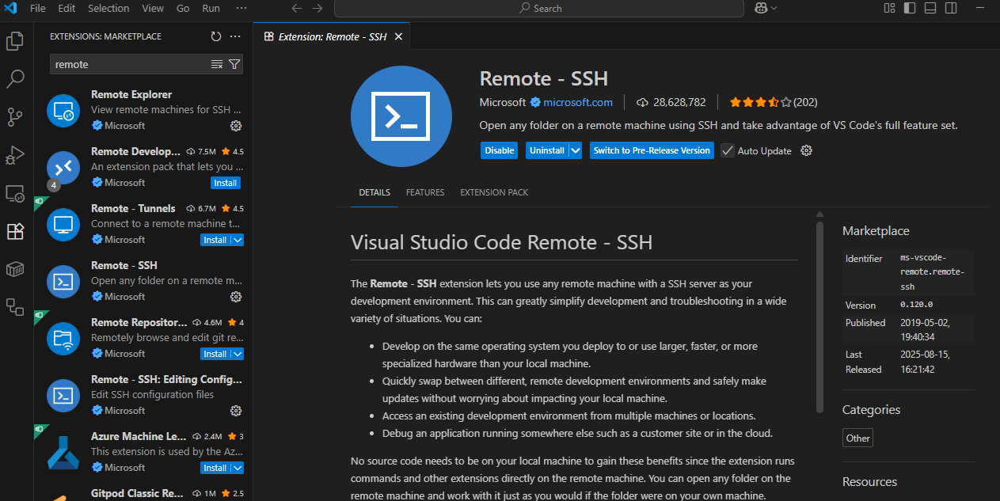
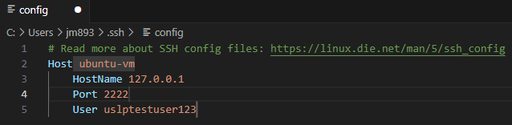
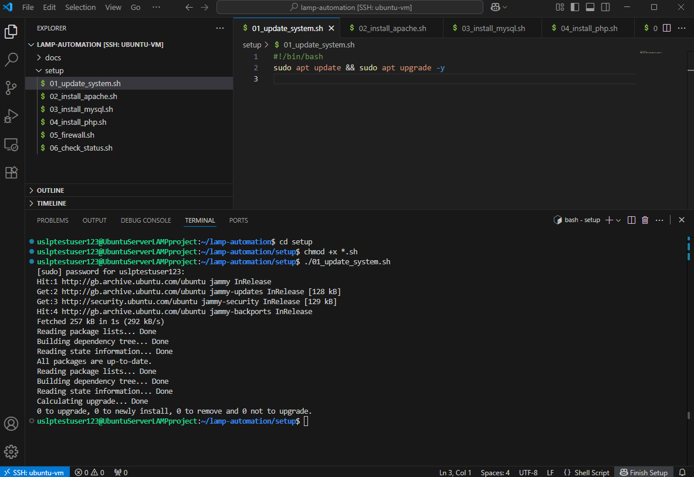
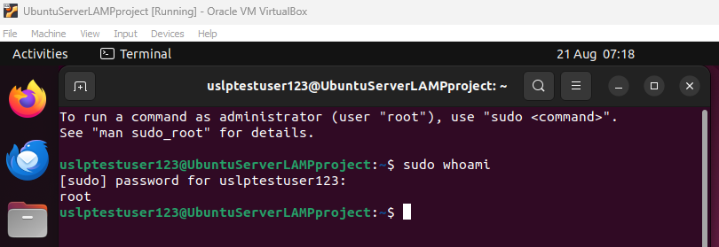

# 🐧 LAMP Stack Automation on Local VM

This project sets up a Linux web server using Apache, MySQL, and PHP — just like a real cloud server — but all on your local machine.

## 🔧 Tech Stack
- Ubuntu 22.04
- Apache 2
- MySQL 8
- PHP 8
- Bash Scripting
- VirtualBox

## 🚀 How to Run
1. Spin up an Ubuntu VM (Download ISO first separately)
2. Run the scripts in `setup/`
3. Visit `http://localhost` to see your web server

## 🎓 Why This?
Great for beginners in cloud engineering who want to build cloud-ready systems with zero cost.

## 📸 Screenshots

### Apache2 Default Page proof

### PHP Information Page proof

### VS Code - Remote SSH Extension for VM

### VS Code - SSH file

### Running scripts from VS Code SSH'd into Linux VM

### Granted user sudo rights in order to install OpenSSH server

# 🖥 LAMP Stack Automation – Project Steps Recap

## 1. Set Up Ubuntu VM →

-Install Ubuntu 22.04 in VirtualBox and log in.

## 2. (Optional) Enable SSH & Connect with VS Code →

-Install OpenSSH, get VM IP, connect via Remote-SSH.

## 3. Create Project Structure →

lamp-automation/setup and docs folders.

## 4. Write Bash Scripts →

-Update system

-Install Apache

-Install MySQL

-Install PHP

-Configure firewall

-Check service statuses

## 5. Make Scripts Executable →

chmod +x setup/*.sh.

## 6. Run Scripts in Order →

-Execute from 01_update_system.sh through 06_check_status.sh.

## 7. Test Web Server →

-Visit http://localhost in VM browser to see PHP info page.

## 8. Push to GitHub →

-Initialize Git, commit files, add remote, push.

## 9. Write README.md →

-Overview, instructions, screenshots.
